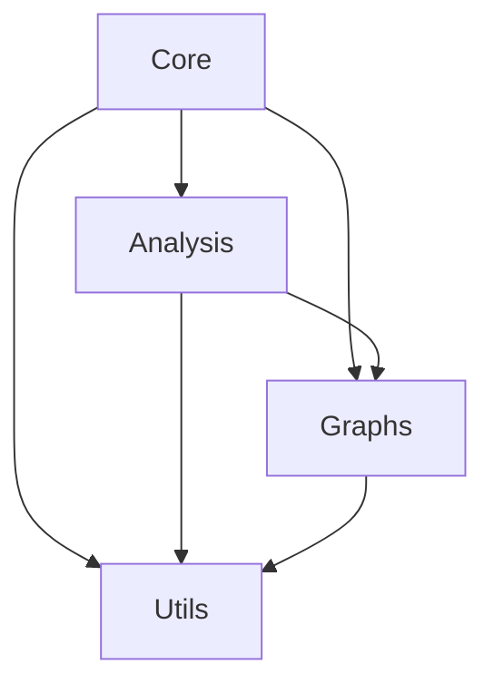

# Architecture Overview

## System Architecture

The Mathematical Logic Analysis Framework is organized into four main components:

### 1. Core (mathlogic.core)

The core module provides fundamental data structures and operations:

- `EntailmentCone`: Main class for representing logical relationships
- `LogicalStatement`: Represents individual mathematical statements
- `EntailmentRelation`: Represents relationships between statements

```python
from mathlogic.core.entailment import EntailmentCone
cone = EntailmentCone()
```

### 2. Analysis (mathlogic.analysis)

The analysis module contains tools for analyzing mathematical structures:

- Structural Analysis
- Independence Detection
- Pattern Recognition
- Metrics Computation

```python
from mathlogic.analysis.structural import StructuralAnalyzer
analyzer = StructuralAnalyzer(cone)
```

### 3. Graphs (mathlogic.graphs)

The graphs module handles graph operations:

- Graph Creation
- Visualization
- Graph Metrics
- Subgraph Extraction

### 4. Utils (mathlogic.utils)

Utility functions and helper tools:

- Metric Calculations
- I/O Operations
- Performance Optimizations

## Data Flow

1. Statement Creation
   ```python
   statement = LogicalStatement("ZFC", "Zermelo-Fraenkel set theory")
   ```

2. Relationship Definition
   ```python
   relation = EntailmentRelation(source=zfc, target=ch, relation_type="Independence")
   ```

3. Analysis
   ```python
   results = analyzer.analyze_structure()
   ```

4. Visualization/Output
   ```python
   from mathlogic.graphs.visualization import visualize_graph
   visualize_graph(results.graph)
   ```

## Component Relationships



## Design Principles

1. **Modularity**: Each component is independent and has a single responsibility
2. **Extensibility**: Easy to add new analysis methods or graph types
3. **Performance**: Optimized for large mathematical structures
4. **Clarity**: Clear API and consistent naming conventions

## Performance Considerations

- Caching of frequently computed metrics
- Parallel processing for large graphs
- Memory-efficient data structures
- Lazy evaluation where appropriate

## Error Handling

The framework uses a comprehensive error handling system:

```python
from mathlogic.core.exceptions import EntailmentError

try:
    cone.add_relation(relation)
except EntailmentError as e:
    print(f"Invalid entailment relation: {e}")
```

## Testing Strategy

Each component has associated unit tests:

- Core functionality tests
- Integration tests
- Performance benchmarks
- Edge case validation

```bash
pytest mathlogic/tests/core/
pytest mathlogic/tests/analysis/
pytest mathlogic/tests/graphs/
```

## Future Extensions

The architecture is designed to accommodate:

1. New analysis methods
2. Additional visualization types
3. Custom metrics
4. Alternative graph representations

